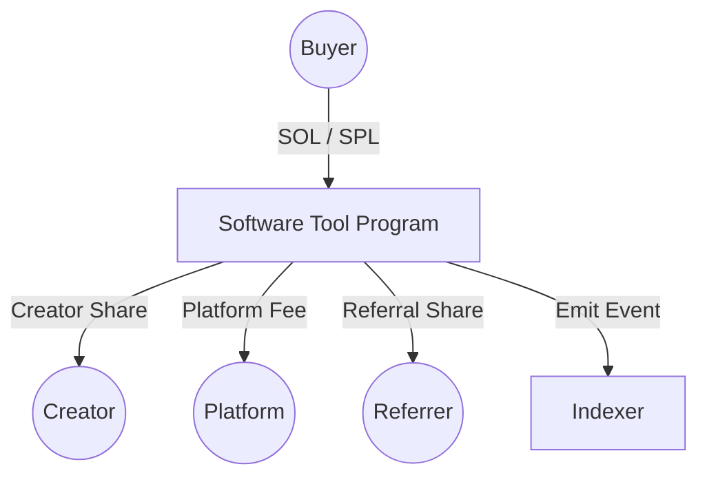

# Software Tool – Solana Anchor Payment Program

**Software Tool** is a minimal, non-custodial Solana program built with Anchor that enables atomic payments between a buyer, a creator, a platform, and (optionally) a referrer.

The program is intentionally designed as a **neutral software utility**:

- No owner
- No admin
- No custody
- No stored balances
- No upgrade control (after authority burn)

It performs **direct, atomic transfers** and emits structured events for off-chain indexing.

---

## Table of Contents

- [Architecture Overview](#architecture-overview)
- [Program Design Principles](#program-structure)
- [Instructions](#instructions)
  - [purchase_with_sol](#purchase_with_sol)
  - [purchase_with_token](#purchase_with_token)
- [Fee Logic](#fee-logic)
- [Event Model](#event-model)
- [Security & Legal Constraints](#security--legal-constraints)
- [What We Explicitly Do NOT Support](#what-we-explicitly-do-not-support)
- [Testing](#testing)
- [Upgrade & Deployment Policy](#deployment-policy)

---

## Architecture Overview

The program acts purely as a **stateless payment router**.

It does not:

- Store funds
- Store configuration
- Store privileged addresses
- Maintain internal balances

All wallets are passed dynamically at runtime.



### Key Properties

- **Atomic Execution** — all transfers succeed or all fail.
- **Zero Program Balance** — the program must never retain funds.
- **Runtime-configurable fee** — passed per transaction.
- **Optional referral split** — configurable per transaction.
- **No privileged authority** — no owner, no pause, no blacklist.

---

## Program Structure

Program ID:

```
C3Veo4eAWJruyBVBtedtRm2oKpvg53v2dxZmjMzEDWy1
```

Main entrypoints:

```rust
purchase_with_sol(...)
purchase_with_token(...)
```

---

# Instructions

---

## purchase_with_sol

Allows a buyer to purchase content using native SOL.

### Arguments

- `content_id: String`
- `purchase_id: String`
- `amount: u64`
- `fee_bps: u16`
- `referrer_fee_bps: u16` (new)

### Accounts

- `buyer` (Signer, mutable)
- `creator` (UncheckedAccount, mutable)
- `platform` (UncheckedAccount, mutable)
- `referrer` (Optional, mutable)
- `system_program`

> Even though `referrer` is optional, `null` must be explicitly passed when no referrer is used.

---

### Flow

1. Validate:

   - `fee_bps <= MAX_FEE_BPS`
   - `referrer_fee_bps <= MAX_REFERRER_FEE_BPS`
   - `referrer_fee_bps <= fee_bps`

2. Compute:

   - `total_fee`
   - `referrer_fee`
   - `platform_fee = total_fee - referrer_fee`
   - `creator_amount`

3. Transfer SOL:

   - buyer → creator
   - buyer → platform
   - buyer → referrer (if provided & fee > 0)

4. Emit `PurchaseEvent`

---

### SOL Transfer Logic

Uses CPI to:

Solana System Program

All transfers occur within the same instruction context.

If any transfer fails → entire transaction fails.

---

## purchase_with_token

Allows a buyer to purchase content using an SPL token (e.g., USDC).

### Arguments

- `content_id: String`
- `purchase_id: String`
- `amount: u64`
- `fee_bps: u16`
- `referrer_fee_bps: u16`

### Accounts

- `buyer` (Signer)
- `creator`
- `platform`
- `referrer` (Optional)
- `mint`
- `buyer_token_account`
- `creator_token_account`
- `platform_token_account`
- `referrer_token_account` (Optional)
- `token_program`
- `associated_token_program`
- `system_program`

If a referrer is provided, both:

- `referrer`
- `referrer_token_account`

must be passed.

If no referrer is used:

```ts
referrer: null;
referrer_token_account: null;
referrerFeeBps = 0;
```

---

### Anchor Account Constraints

The program enforces:

- `buyer_token_account.owner == buyer`
- `buyer_token_account.mint == mint`
- `creator_token_account.owner == creator`
- `platform_token_account.owner == platform`
- `referrer_token_account.owner == referrer` (if provided)

All constraints are enforced at the Anchor level.

---

### Token Transfers

Uses CPI into:

SPL Token Program

Atomic transfers:

- buyer → creator
- buyer → platform
- buyer → referrer (if applicable)

If any transfer fails → transaction reverts.

---

# Fee Logic

The fee is passed as:

```
fee_bps: u16
referrer_fee_bps: u16
```

Where:

```
10000 BPS = 100%
```

---

### Hard Caps

```
MAX_FEE_BPS = 3000        (30%)
MAX_REFERRER_FEE_BPS = 500 (5%)
```

Constraints:

- `referrer_fee_bps <= fee_bps`
- Platform fee is derived as:

  ```
  platform_fee = total_fee - referrer_fee
  ```

The program does **not store** fee configuration.

Each platform can define its own fee model externally.

---

### Safe Arithmetic

All math uses:

- `checked_mul`
- `checked_div`
- `checked_sub`

Prevents:

- Overflow
- Underflow

---

# Event Model

Each purchase emits:

```rust
PurchaseEvent {
    content_id: String,
    purchase_id: String,
    buyer: Pubkey,
    creator: Pubkey,
    platform: Pubkey,
    referrer: Option<Pubkey>,
    mint: Option<Pubkey>,
    currency_type: CurrencyType,
    decimals: u8,
    amount: u64,
    creator_amount: u64,
    platform_fee: u64,
    referrer_fee: u64,
    fee_bps: u16,
    slot: u64,
    timestamp: i64,
}
```

### Event Guarantees

- `referrer` is `None` if not provided
- `referrer_fee = 0` when no referrer
- `platform_fee` always reflects the net platform amount
- The sum of `creator_amount + platform_fee + referrer_fee == amount`

---

# Critical Design Constraints (Non-Negotiable)

The program intentionally does NOT include:

### ❌ No Owner / Admin

No stored `Pubkey` with special privileges.

### ❌ No Pause Function

Payments cannot be stopped.

### ❌ No Blacklist

No wallet filtering.

### ❌ No Stored Fee

Fee is provided per transaction.

### ❌ No Withdraw

Program never holds funds.

### ❌ No Escrow

No custody at any time.

### ❌ No PDAs Holding Funds

No program-owned treasury accounts.

### ❌ No Upgradeability After Stabilization

Upgrade authority must be burned after audit and mainnet validation.

If changes are needed → deploy a new program.

---

# Zero Balance Guarantee

After every transaction:

- Program SOL balance must remain zero (excluding rent-exempt edge cases)
- No token accounts owned by the program
- No PDAs storing funds

---

# Testing

Build and run tests:

```bash
yarn install
anchor build
anchor test
```

---

## Environment Setup

Before running tests:

1. Create a `.env` file.
2. Use `.env.example` as a reference template.

---

## SPL Token Testing

- Supported SPL tokens are stored in an array.
- During local testing:

  - A local test token is automatically created.
  - It is temporarily included in the supported tokens list.

- No contract code modifications are required for tests.
- No commenting out validation logic is necessary.

This ensures:

- Deterministic local testing
- No manual mint preparation
- Clean production deployment

---

# Security Considerations

- All transfers are direct wallet-to-wallet.
- No intermediate custody.
- All arithmetic is checked.
- Account ownership is validated.
- Token mint consistency is enforced.
- Transaction atomicity guaranteed by Solana runtime.

Built on:

Solana
Anchor

---

# Deployment Policy

1. Deploy program.
2. Thorough testing (local + devnet).
3. External security audit.
4. Stabilization period.
5. **Burn upgrade authority permanently.**

After burn:

- No one (including deployer) can modify behavior.
- Any update requires a new program deployment.

---

# What This Program Is

- A stateless payment router
- A neutral software tool
- A deterministic atomic transfer executor
- An event emitter for off-chain indexing

# What This Program Is NOT

- Not an escrow
- Not a custody solution
- Not a marketplace
- Not a dispute layer
- Not upgrade-controlled infrastructure
